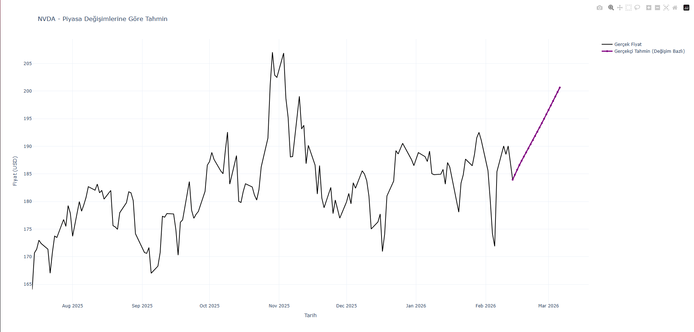

# 📈 Stock Price Prediction with LSTM
### NVDA Case Study — Deep Learning for Time-Series Forecasting




---

## 🧠 Overview

This project applies **Long Short-Term Memory (LSTM)** neural networks to predict future price trends of NVIDIA (NVDA) stock. Rather than forecasting raw prices, the model learns from **daily percentage changes** — making it more generalizable across different price levels and market conditions.

The model analyzes the past **60 days** of market data to forecast the trend for the next **21 days**.

---

## 🎯 Why LSTM?

Standard RNNs suffer from the **vanishing gradient problem** — they struggle to retain information over long sequences. LSTM solves this with a dedicated memory cell that learns *what to remember* and *what to forget*.

For a 60-day lookback window, this long-term memory capability is essential.

> **Why not GRU?** GRU is a lighter alternative with similar performance. LSTM was chosen here for its more explicit memory mechanism, which suits longer sequences well.

---

## 🛠️ Technical Details

### Data
- **Source:** Yahoo Finance via `yfinance`
- **Input feature:** Daily percentage change (`pct_change`)
- **Normalization:** MinMaxScaler scaled to `(-1, 1)` — aligned with the tanh activation used inside LSTM layers

### Model Architecture

```
Input (60 days × 1 feature)
        ↓
LSTM Layer 1 — 50 units, return_sequences=True
        ↓
Dropout (0.2)
        ↓
LSTM Layer 2 — 50 units
        ↓
Dropout (0.2)
        ↓
Dense Output Layer — 21 units (21-day forecast)
```

### Hyperparameter Choices

| Parameter | Value | Reason |
|---|---|---|
| Lookback window | 60 days | Balanced between too short (30) and noisy (120+) |
| Forecast horizon | 21 days | ~1 trading month, reasonable inference range |
| LSTM layers | 2 | Captures both short and long-term patterns without overfitting |
| Dropout rate | 0.2 | Standard for time-series; reduces overfitting on volatile data |
| Normalization range | (-1, 1) | Matches tanh activation inside LSTM cells |

---

## 📊 Results

The model successfully captures **trend direction** on unseen test data. Exact price prediction in financial markets is inherently noisy, but percentage-change modeling provides a more robust signal than raw price forecasting.

Evaluation metric: **RMSE** (Root Mean Squared Error) — chosen because it penalizes large deviations more heavily, which is critical in financial forecasting.

---

## 📦 Installation & Usage

```bash
# Clone the repository
git clone https://github.com/metehanulger/stock-price-prediction-lstm.git
cd stock-price-prediction-lstm

# Install dependencies
pip install -r requirements.txt

# Run the prediction
python predict.py
```

---

## 🧪 Key Learnings

- **Vanishing gradient problem** and why LSTM outperforms vanilla RNNs on long sequences
- **Data normalization** aligned with activation functions improves training stability
- **Overfitting control** via Dropout layers — especially important with limited financial data
- **Train/test split** methodology to prevent data leakage in time-series models
- **Hyperparameter sensitivity** — lookback window and forecast horizon significantly affect model behavior

---

## ⚠️ Disclaimer

This project is for **educational purposes only**. Predictions generated by this model are not financial advice. Stock market trading involves significant risk.

---

## 👤 Author

**Metehan Ülger**  
Software Engineering Student  
[GitHub](https://github.com/metehanulger)
